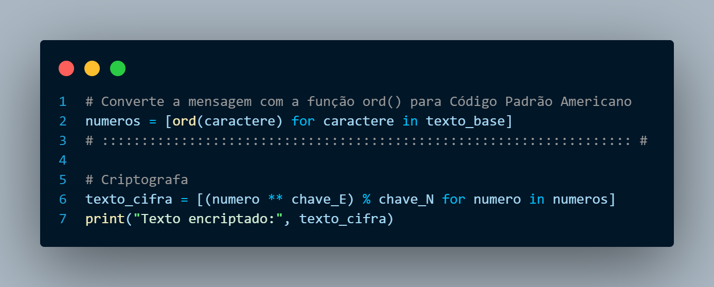

# CriptografiaPython

Projeto para faculdade com um algoritmo em python que criptografa uma mensagem usando a técnica RSA

## A técnica RSA

Este modelo de criptografia emprega um sistema com cinco chaves: três chaves privadas e duas chaves públicas. A segurança do sistema é fortalecida pelo uso de números primos. Para garantir ainda mais segurança, o projeto randomiza valores para gerar essas chaves e criptografar a mensagem.

    
    
    
    
    
    
    
    
    

No processo de criptografia, a mensagem é inicialmente convertida em bytes para posterior manipulação. Em seguida, números primos aleatórios são gerados para criar três chaves privadas distintas. Além disso, duas chaves públicas correspondentes às chaves privadas são geradas. Essas chaves são fundamentais para os processos de criptografia e descriptografia.

    

Durante a criptografia, a mensagem em formato de bytes é cifrada utilizando as duas chaves públicas. Esse processo transforma a mensagem original em uma forma codificada, tornando-a segura contra visualizações não autorizadas.

Na etapa de descriptografia, as chaves privadas correspondentes são usadas para decifrar a mensagem codificada. Esse procedimento reverte a transformação, permitindo a recuperação da mensagem original em formato de bytes. Esse método sofisticado garante a confidencialidade das comunicações, tornando-as acessíveis apenas para as partes autorizadas.

